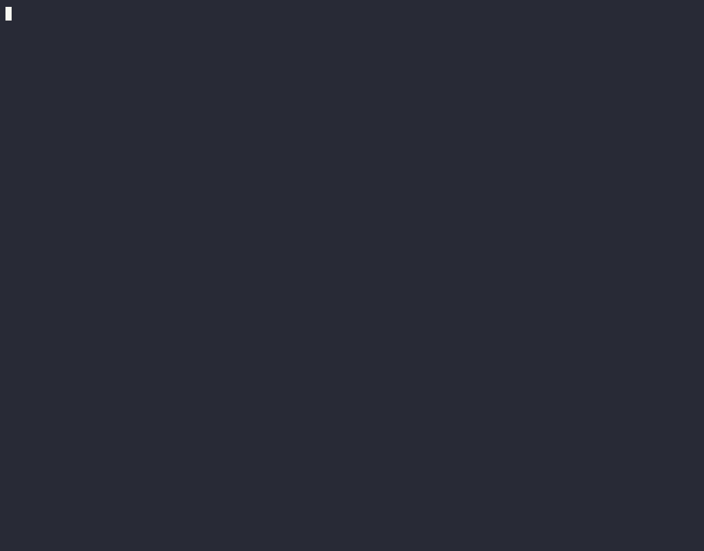

# agentic



Monorepo:

| Package | Role | PHP |
|---|---|---|
| `packages/agentic` — `gplanchat/agentic` | `Domain/`: the model (tool guard, questions, watches, context budget, delegation), framework-free. `Application/`: ports and use cases (`Conversations`, `AgentTool`, `help`). `Infrastructure/`: the durable workflow and its Symfony AI 0.13 adapters (pinned). Depends on `gplanchat/durable`. | ≥ 8.2 |
| `packages/agentic-bundle` — `gplanchat/agentic-bundle` | Symfony integration: the `agentic` TUI application (`help`, `chat`) and its web version. Depends on `gplanchat/durable-bundle` and `symfony/tui`. | ≥ 8.4.1 |
| root | Dev application installing both by `path`. | ≥ 8.4.1 |

The decisions the code cannot state on its own — why, and what was turned down — are in
[`docs/decisions/`](docs/decisions/README.md). Start with
[ADR-001](docs/decisions/ADR-001-value-objects-and-enums.md): value objects over arrays, enums over
magic strings, and where the journal boundary puts the limit on both.

```bash
composer install
bin/agentic                          # help in the TUI (q, Esc or Ctrl+C to quit)
bin/agentic chat                     # talk to the agent (Shift+Tab mode, ↑↓ history, wheel scrolls, Ctrl+X closes, Ctrl+C quits)
bin/agentic chat <conversation>      # resume a conversation (its id is printed when you quit)
php8.4 -S localhost:8000 -t public   # the web version: http://localhost:8000/agentic/
```

Tests, package by package (PHPUnit 11 for `agentic`, which must stay installable on PHP 8.2):

```bash
(cd packages/agentic && composer install && php8.2 vendor/bin/phpunit)
(cd packages/agentic-bundle && composer install && php8.4 vendor/bin/phpunit)
```

Each package splits its suite along the test pyramid (`static`, `unit`, `functional`,
`integration`; `--testsuite <layer>`); `tests/TestPyramidTest.php` fails when a test sits in no
layer or in two. No e2e yet.

The static layers run PHPUnit's static suite then PHPStan (level 8, `phpstan.dist.neon` per
package, a baseline for the errors the code already had: fixing one means deleting its entry).
New code meets the level — it does not go to the baseline.

The mutation layers run Infection (`tools/infection`, a tool project of its own: it needs PHP ≥ 8.3,
so it cannot be a dependency of `packages/agentic`, which stays installable on 8.2) over the lines
changed since HEAD, new files included. A surviving or uncovered mutant is RED, and the verdict asks
for a sharper test — never for other code. Two things follow from where Infection lives: it runs the
tests it mutates under PHP 8.4, so a green `component-mutation` says nothing about the 8.2 floor that
`component-unit` and `component-functional` check; and a worktree borrows `tools/*/vendor` read-only
through `sandbox.shared`, like any other installed dependency.

## The chat

A conversation is an execution of the `DurableAgentWorkflow` workflow; every message, approval,
answer or alert is a signal. The TUI acts as the worker: it drains Durable's Messenger transports on
every refresh, with no `messenger:consume` alongside.

- Without `MISTRAL_API_KEY`, a scripted client answers, with no network: "What is the weather in
  Paris?" (read-only tool), "Send a mail" (approval), "Ask me a question", "Watch the delivery"
  (watch), "Delegate…" (sub-agent). A trigger is matched as a whole word.
- With `MISTRAL_API_KEY` (in `.env.local`, ignored by git, or in the environment), Mistral answers;
  its replies are formatted (Markdown). The model call happens inside the TUI process, but through an
  Amp HTTP client on the same event loop: the screen stays alive while it waits — the banana dances,
  the counter runs, the thread can be scrolled.
- A tool that fails three times in a row is handed back to the model as its result ("Tool … failed");
  a failing model call ends the conversation, and the header says why.
- Chat commands, typed instead of a message (Tab completes the name):
  `/help`, `/mode [plan|standard|edition|auto]`, `/model [name]` (from the next message on),
  `/tools` (and what the guard makes of each in the current mode), `/clear` (new conversation),
  `/rewind [n°]` (go back before one of your messages, which returns to the input), `/compact`
  (restart from a summary), `/resume [id]` (resume a past conversation).
  `/rewind`, `/compact` and resuming a finished conversation open a fresh conversation from the
  thread: the journal of the old one is never rewritten.
- The wheel and PgUp/PgDn scroll the thread inside the chat: the terminal switches to mouse mode for
  the duration. To select text with the mouse, hold Shift (most terminals).
- ↑/↓ recall the messages and commands already sent, like a shell.
- **Modes** (Shift+Tab rotates, `/mode` sets): `plan` reads only and **refuses** the rest, `standard`
  reads and holds writes for approval, `edition` writes and holds external effects, `auto` lets
  everything through. `plan` is not a stricter `standard`: `standard` suspends the conversation on an
  approval card, `plan` answers the model at once and tells it to say what it would do instead — so a
  planning agent keeps planning rather than waiting for a decision nobody meant to take. Leaving plan
  mode is the human's move, `/mode edition`. `plan` is the floor of the order, so a delegate under a
  planning caller plans too, whatever its profile's ceiling says.
- **Token budget** (`token_budget` in `config/packages/agentic.php`): what one run may spend before
  it stops taking turns. **0 by default, which caps nothing** — the spend is counted either way, and
  the header shows it, because counting is the part that cannot be done afterwards. The ceiling is a
  policy an application sets knowing its own traffic. Two things it does not do: the check runs
  before a turn, not during one, so a run overshoots by at most one turn (bounded by `maxToolCalls`
  model calls); and a delegate is a child workflow with its own journal, so **its spend is not
  counted against its caller's** — a run has a budget, a conversation with sub-agents does not yet.
  Offline, the scripted client prices its replies at four characters per token so the counter behaves
  as it does with a provider. **A delegation is counted**: a child hands its total back in its
  return value — the only channel from a child workflow to its parent — and since each level adds
  what its own delegates reported before reporting in turn, one addition per level carries the
  whole tree. The same number reaches the display, so the header and the ceiling cannot drift.
- **Depth of delegation** (`max_delegation_depth`, 2 by default): a delegate keeps the `delegate`
  tool, so without a bound an anonymous delegation could delegate for ever, each level costing a
  model call. At the deepest level allowed the tool is not offered at all, rather than offered and
  refused: a tool the model cannot see is one it does not spend a turn reaching for. `0` forbids
  delegating outright.
- **Decision hooks** (`tool_rules` in `config/packages/agentic.php`): for a tool (an `fnmatch`
  pattern) and, where needed, conditions on its arguments, `allow`, `ask` or `deny`, before the mode.
  Deny wins over ask, which wins over allow; `/tools` shows the rules.
- **`run_command` in a sandbox** (`sandbox` in `config/packages/agentic.php`): bubblewrap mounts the
  project writable, `/usr` and `/etc` read-only, nothing else of the disk; no network, a cleared
  environment, `.env.local`, `.env.*.local` and `var/` hidden, `.git` and `.claude` read-only.
  **Limit:** whatever the agent writes into the project (`composer.json`, `vendor/bin/*`, a test
  bootstrap…) will run on the host when you launch it — review before you do. The screen freezes for
  the duration of a command (120 s at most). No shell: the line is split then executed as is (`;`,
  `|`, `$(…)` stay literal). Outside `auto`, every command asks for approval; in `auto`, only those
  of `sandbox.auto_allow` pass (`fnmatch` patterns over the whole line). If bwrap is missing or
  refused, the chat says so when it opens (`sudo apt install bubblewrap`). Rules also accept `modes`
  and `unless`:
  `['tool' => 'run_command', 'modes' => ['edition'], 'when' => ['command' => 'vendor/bin/phpunit*'], 'decision' => 'allow']`.
- **A worktree per conversation.** A conversation that runs a command works in
  `.worktrees/agentic-<id>`, on branch `agentic/agentic-<id>`, cut from HEAD — the project's
  uncommitted changes are not in it. The agent cannot commit from inside the sandbox (the project's
  `.git` is read-only there); it commits only through `commit_worktree`, on its own branch, as the
  author `agentic`. So **its work is split between commits on `agentic/agentic-<id>` and
  uncommitted changes in the worktree**, and `git diff` alone hides the files it created. Review with
  `git log -p main..agentic/agentic-<id>`, then `git -C .worktrees/agentic-<id> status` and
  `git -C .worktrees/agentic-<id> add -A && git -C .worktrees/agentic-<id> diff --cached`; take the
  work by merging the branch, or by committing in the worktree. Discard it with
  `git worktree remove .worktrees/agentic-<id> && git branch -D agentic/agentic-<id>`.
  **Do not run anything on the host inside a worktree** — `bin/console`, `bin/agentic`, `composer`,
  a test suite, an agent session — before you have reviewed it: ignored files the agent created are
  invisible to `git status`. The sandbox pre-creates and masks `var/`, `.claude/` and `.env.local` in
  each worktree, but not every `.env.*.local`.
  **Nothing is cleaned up automatically**, and that is deliberate — a worktree holds
  the agent's work until someone reviews it, and `/rewind`, `/compact` and `/resume` open new
  conversations that keep the same worktree, so tying removal to a conversation ending would destroy
  live work. A cleanup command may come later.
- **`run_checks(layer, filter?)`** runs one layer of the project checks — whatever `sandbox.checks`
  names: static, unit, functional, integration, e2e — in the same sandbox and workspace, then reads
  its JUnit report. It answers `GREEN — <layer>` or `RED — <layer>` with the counts and each failing
  test with its `file:line` and message (ten at most), instead of kilobytes of raw output;
  `ERROR — <layer>` when no report came out, with the tail of the output, and `RED` too when the
  exit code fails although no test did. Its arguments are closed — a configured layer, a filter
  passed as a single value to `filter_option` — so it needs no allowlist. Classed `write`: it asks
  in `standard`, passes in `edition` and `auto`. One timeout per layer (300 s by default). `tests` per layer says where its
  tests live; `review` per layer names the layers to run once it is green — the GREEN verdict spells
  them out, in order —, and an unknown name there is refused when the tool is built. With checks
  configured, the system prompt carries the pyramid and the TDD cycle
  (red → green → review), and each verdict ends with the next step. A layer that runs
  the bundle suite works from inside the sandbox, nested bwrap included.
- **Sub-agents** (`agents` in `config/packages/agentic.php`): named profiles the `delegate` tool can
  hand a mission to, each with its description (which the model reads to choose), its instructions,
  its model, the tools it may use (`fnmatch` patterns) and its ceiling. `/agents` lists them,
  `/agents <name>` shows one in full, instructions included. **A profile never grants authority**:
  the sub-agent takes the strictest of its ceiling and of its caller's effective mode, so a profile
  declared `auto` stays `standard` in a `standard` conversation — naming a sub-agent must not be the
  way around the guard. A name nobody declares is refused and the model is told which exist. The
  profiles are frozen in the conversation's payload at start, like its tools.
- **MCP servers** (`mcp.servers` in `config/packages/agentic.php`): their tools are offered to the
  agent as `mcp__<server>__<tool>`, over stdio (`command`, `args`, `env`, `cwd`) or HTTP (`url`,
  `headers`). `/mcp` lists the servers, says which are reached and shows their tools.
  **An MCP tool is `external` by default**, so it asks for approval in every mode but `auto`: what a
  server says about its own tools — `readOnlyHint` and the other annotations — is its claim about
  itself, and the guard is what protects from a tool that lies. Give effects explicitly with
  `effects` (a tool name pattern → `read`, `write` or `external`), which wins over everything else,
  or accept the server's word with `trust_annotations: true`. Discovery happens when a conversation
  starts and its schemas are frozen in the payload: a server that changes its tools afterwards does
  not change a running conversation, and a tool that disappeared comes back to the model as a failed
  result. A server that is down costs nothing — no tool, an error shown by `/mcp`, the conversation
  starts anyway. Tried against the official GitHub server, which offers 45 tools:

  ```php
  'mcp' => ['servers' => ['github' => [
      'command' => 'docker',
      'args' => ['run', '-i', '--rm', '-e', 'GITHUB_PERSONAL_ACCESS_TOKEN', 'ghcr.io/github/github-mcp-server', 'stdio'],
      'env' => ['GITHUB_PERSONAL_ACCESS_TOKEN' => '%env(GITHUB_TOKEN)%', 'PATH' => '%env(PATH)%', 'HOME' => '%env(HOME)%'],
      'effects' => ['get_*' => 'read', 'list_*' => 'read', 'search_*' => 'read'],
  ]]],
  ```

  A server reached over `url` works too — GitHub's remote endpoint answers the Streamable HTTP way,
  with a `text/event-stream` that stays open, and the client reads its events as they come. One
  difference with stdio: **an MCP call over HTTP freezes the screen for its duration**, because the
  MCP transport waits inside a fiber of its own rather than on the event loop the TUI runs on.
- **`read_file` and `edit_file`** work in the same sandbox and the same workspace as `run_command`
  (the conversation's worktree). `read_file` (`read`, passes in every mode) prints numbered lines,
  400 by default, with `offset`/`limit`, and says how to read on; on a directory it lists the
  entries. `edit_file` (`write`: asks in `standard`, passes in `edition` and `auto`) replaces an
  exact `old_string`, which must be unique unless `replace_all` is set; an empty `old_string`
  creates a file — and its directories — that must not exist yet. Both run as a small PHP script
  inside bwrap, so they see exactly what `run_command` sees. They refuse what resolves outside the
  workspace (`..`, absolute paths, symlinks), what is read-only (`.git`, `.claude`, the borrowed
  `vendor/`) and what is masked (`.env.local`, `var/`…), with a sentence rather than a silent
  success. Two things worth saying plainly: in `auto`, `edit_file` plus an allowlisted
  `vendor/bin/phpunit` runs whatever the agent just wrote, without approval — `auto_allow` limits
  which programs start, not what code they run, and the sandbox is the barrier; and `read_file`
  reads HEAD's version of the files, not your uncommitted edits, its first call being what cuts the
  worktree even in `standard`.
- **`AGENTS.md`** at the project root (path configurable through `instructions_file`): appended to
  the system prompt when a conversation starts, truncated beyond 32 KiB. It carries the code
  convention of [ADR-001](docs/decisions/ADR-001-value-objects-and-enums.md) and nothing the prompt
  already says — the pyramid and the TDD cycle come from `run_checks`, and paying for them twice
  would cost every turn of every conversation.
- **Journal on SQLite** (`var/agentic.sqlite`): conversations survive the TUI being closed and can be
  resumed. The Messenger transports stay in memory, the TUI being the only worker: a turn in flight
  when you quit is lost. **A conversation belongs to whoever opened it**, and a run that fails keeps
  its owner: Durable drops the execution's metadata row on failure — the start payload with it — so
  the projection recovers the owner from the journal, where every tool call carries it. A run that
  failed before calling a single tool leaves nothing to recover; it is refused as *unknown owner*,
  not as somebody else's, and the chat says so in its header rather than dying on it.
- **Tickets: the project's plan** (EWA-002). A project names its forge in its `.agentic/config.*` —
  `tickets: {forge: github, repository: owner/name}`, or `{forge: forgejo, repository: owner/name,
  url: 'https://codeberg.org'}` — and the installation holds the token (`AGENTIC_TICKETS_TOKEN`,
  `tickets_token` in `config/packages/agentic.php`), never the project. **The forge is the source of
  truth of the plan.** A **head** ticket is what matters to whoever pays — an OpenSpec change, of a
  family chosen by what it changes: `defect`, `debt`, `groundwork`, `capability`, `investigation`
  (an investigation must say its time box and the decision it enables). Its label is the project's
  word for it (`tickets.labels`, e.g. `{debt: 'dette technique'}`), and must exist on the forge:
  none is created. A **work** ticket is one task `N.M` a person finishes in a day, with its proof;
  it hangs under an open head — a sub-issue on GitHub; on Forgejo, which has none, a `Head: #12` line
  in its body plus a dependency, so Forgejo itself refuses to close a head over open work. It closes
  with its code: `commit_worktree` with `closes` writes `Closes #n`, and the forge closes it at the
  merge. An OpenSpec `⛔ attend:` is a "blocked by" link between tickets; a cycle is refused, and a
  ticket closed as *not planned* or *duplicate* (GitHub) does not unblock. A link to another
  repository is refused, never read as the local ticket of the same number. Tools: `ticket_read`
  (read), `ticket_open_head`, `ticket_open_work`, `ticket_block`, `ticket_unblock`, `ticket_close`
  (heads only, once their work is closed), `ticket_comment` — all `external`: `plan` refuses them,
  `standard` asks. A
  rule allowing them holds in every mode unless it says `modes`. Opening survives a retry: the call's
  id is written in the body and looked for before opening again. Forgejo needs issue dependencies
  enabled in the repository's settings.
- **Skills: the work, as procedures.** With a ticket tracker, four skills, drawn from Épopée and
  rewritten for the forge, Mikado and the git tools: `/status` (the plan at a glance and at most five
  tickets worth taking, read-only), `/scope <need>` (a head of the right family, its OpenSpec change
  in `openspec/changes/` when a specified behaviour moves, its work tickets with their proofs),
  `/continue [#n]` (one work ticket: taken, conducted with Mikado and TDD, judged, closed by its
  code), `/review [#n]` (the work judged by a verifier that did not make it). A command sends a short
  request as your message; the `skill` tool — whose description is the index — hands the agent the
  procedure only then. Tickets are *taken* with a `taken` label (`ticket_take`, `ticket_release`), and
  what waits on someone carries `waits:author`, `waits:third-party` or `waits:measure` (`ticket_wait`,
  with the reason in a comment): labels to create on the forge beforehand, like the family labels.
  Two seats, both sub-agents at the `plan` ceiling: the `planner` reads the tickets strangers wrote
  for `/status`, with only `ticket_list` and `ticket_read` — nothing to act on what a ticket says —;
  the `verifier` judges the ticket against the diff with `ticket_read`, `worktree_diff` and
  `read_file`, and changes nothing: the maker never grades its own work, and `continue` commits each
  TDD phase (`test(…)` red, then `feat(…)`/`fix(…)`) so that it can check the order. An
  installation's own profile of the same name replaces a seat. `continue` still reads its own ticket
  in the working conversation: there, the rule that a ticket is data, the worktree and the guard are
  the defence. In Linas's terms
  (*agentic OS*), these are the employees; the constitution (`AGENTS.md`), the walls (modes, sandbox,
  worktree, rules), the gate (`run_checks`) and the budget are in place, while the trust ledger per
  skill, the standing goals and the unattended heartbeat (`/dev:go`'s counterpart) are not yet.
- **Mikado: the conduct of one task.** Inside a work ticket, the agent keeps the task's graph with
  `mikado_start` (the goal, M1, and optionally its work ticket), `mikado_note`, `mikado_done` and
  `mikado_show`: it tries the change naively, `run_checks` goes red, it notes each prerequisite,
  `revert_worktree` back to its last commit, does a READY node, `commit_worktree` once green,
  `mikado_done` — up to the goal, then posts the graph on the work ticket (`ticket_comment`, posted
  once however often the call is retried). The prerequisites are not tickets — they would be leaves
  with no time and no proof; one too big for the task becomes a new work ticket. The graph is
  workflow state, changed by tools the workflow runs itself (classed `read`: `plan` may keep it),
  journaled at each change, and carried to the next run by the relay, `/resume`, `/compact` and
  `/rewind` — its **latest** state even on `/rewind`: it describes the code in the worktree, which
  is not rewound either. A run that carries one is told of it in its system prompt. A delegate
  starts without its caller's graph. A conversation begun before these tools replays without them
  (a Durable change point, `mikado-tools`). Both git tools run on the host, in the conversation's
  worktree only, with hooks and fsmonitor off; they are `write`.
